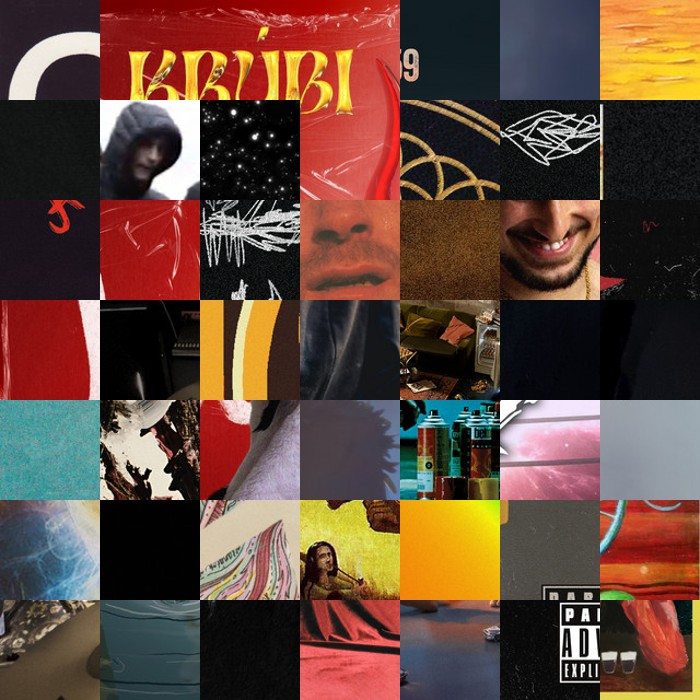

# YearCover

Welcome to the YearCover - my Spotify Streamlit app! 🎵✨

This app allows you to log in to your Spotify account and generate a stunning collage of album covers from your top 50 most listened tracks. It's a fun and visual way to see your music preferences over the past year!

- **Album Cover Collage**: Generate a beautiful 7x7 pixelated collage of album covers from your top tracks.

## How to Use

1. **Clone the Repository**:

   ```bash
   git clone https://github.com/barnabashub/yearcover.git
   cd yearcover
   ```

2. **Install Dependencies**:

   ```bash
   pip install -r requirements.txt
   ```

3. **Run the Streamlit App**:

   ```bash
   streamlit run new_streamlit_app.py
   ```

4. **Log in to Spotify**:

   - Click on the "Login to Spotify" link.
   - Authorize the app to access your Spotify data.

5. **Generate Your Collage**:
   - Once logged in, the app will fetch your top 50 tracks and generate a collage of album covers.
   - The collage will be displayed on the app page.

## Example



## You will need

You will need a spotify developer api app.
The dashboard will generate your client id and client secret what you should paste to the secrets.toml file.
The redirect url should be the same url your app will run. (localhost:8501)

## Technologies Used

- **Streamlit**: For the web interface.
- **Spotipy**: For interacting with the Spotify API.
- **Pillow**: For image processing.
- **Requests**: For making HTTP requests.

---

Enjoy visualizing your music preferences with the YearCover app! 🎶📸
